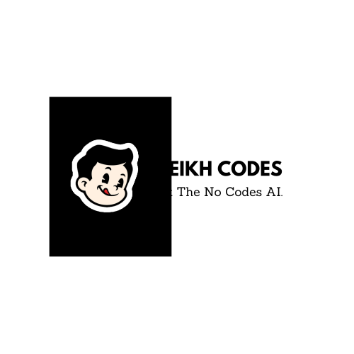
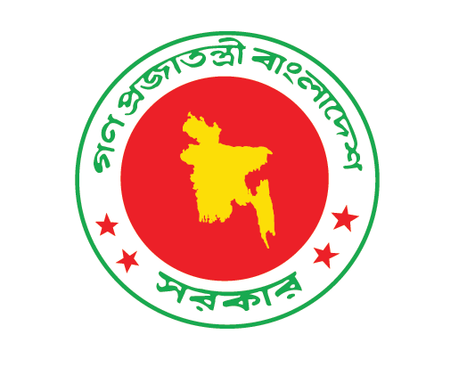
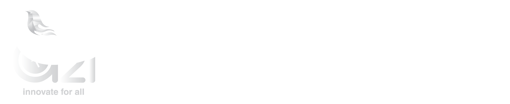

#  Likhon Sheikh 

  
  

  

## 🏆 Awards & Recognition

  
  
  
  
  
  
  

## 🌟 Featured Projects

  <picture>
    <source 
      srcset="https://github-readme-stats.vercel.app/api/pin/?username=likhonsheikhofficial&repo=project-name&theme=radical&hide_border=true"
      media="(prefers-color-scheme: dark)"
    />
    <source
      srcset="https://github-readme-stats.vercel.app/api/pin/?username=likhonsheikhofficial&repo=project-name&theme=buefy&hide_border=true"
      media="(prefers-color-scheme: light), (prefers-color-scheme: no-preference)"
    />
    
  </picture>
  
  <picture>
    <source 
      srcset="https://github-readme-stats.vercel.app/api/pin/?username=likhonsheikhofficial&repo=another-project&theme=radical&hide_border=true"
      media="(prefers-color-scheme: dark)"
    />
    <source
      srcset="https://github-readme-stats.vercel.app/api/pin/?username=likhonsheikhofficial&repo=another-project&theme=buefy&hide_border=true"
      media="(prefers-color-scheme: light), (prefers-color-scheme: no-preference)"
    />
    
  </picture>

## 🤝 Trusted By

  <table border="0">
    <tr>
      <td align="center">
        
        
        
        
      </td>
      <td align="center">
        
        
        
        
      </td>
    </tr>
    <tr>
      <td align="center">
        
        
        
      </td>
      <td align="center">
        
        
        
      </td>
    </tr>
  </table>

---

  <picture>
    <source 
      srcset="https://raw.githubusercontent.com/platane/snk/output/github-contribution-grid-snake-dark.svg"
      media="(prefers-color-scheme: dark)"
    />
    <source
      srcset="https://raw.githubusercontent.com/platane/snk/output/github-contribution-grid-snake.svg"
      media="(prefers-color-scheme: light), (prefers-color-scheme: no-preference)"
    />
    
  </picture>
  
   
   
  
  Powered by  SheikhOS

